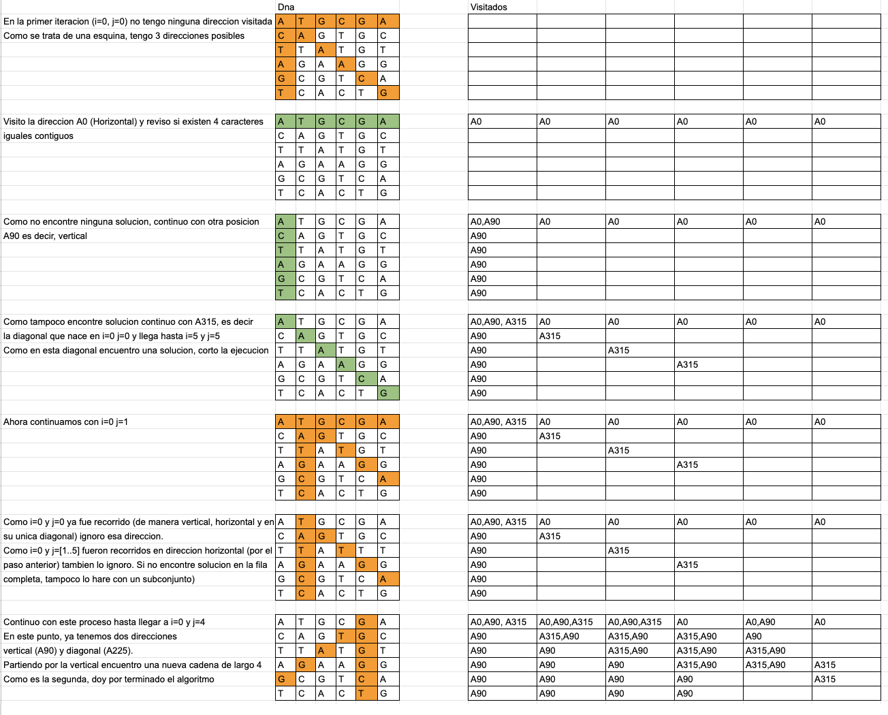

# Mutants 

API Rest para la deteccion de ADN mutante y su relacion respecto al ADN humano


## Instrucciones para correr el proyecto

El proyecto puede levantarse de dos maneras:

### Manualmente

1. Instalar Redis en nuestra maquina, ya sea via Docker o directamente
2. Configurar la variable de entorno:
3. Ejecutar el comando:

```shell
mvn package
```

ubicados en el directorio raiz del proyecto

4. Ejecutar el comando:

```shell
java -jar {path-to-target}/meli-mutants-0.0.1-SNAPSHOT.jar
```

5. El aplicativo quedara levantado en el puerto 8080

### Dockerizado

Adicionalmente, se entrega junto con el codigo fuente que resuelve el requerimiento, un archivo docker-compose que ya
realiza el trabajo de configurar un redis y correr el aplicativo. Para esto haremos:

1. Ejecutar el comando

```shell
docker compose build
```

En la raíz del proyecto, por unica vez.

2. Ejecutar el comando

```shell
docker compose up
```

En la raíz del proyecto

3. El aplicativo quedara levantado en el puerto 8080

## Documentacion

### Explicacion del algoritmo


### Swagger UI
http://localhost:8080/swagger-ui/index.html?configUrl=/v3/api-docs/swagger-config

## Algunas consideraciones
* El proyecto cuenta con 100% de coverage. Se excluyeron solo las clases de configuracion, la clase principal y aquellas 
que estan anotadas con `@Generated`.
* El proyecto cuenta con 0 Code Smells según SonarQube (con la configuración default de Java)
* La eleccion de Redis como almacenamiento principal no es caprichosa. Se decidio optar por redis
por su excelente performance (O(1)) en la inserción en Conjuntos, y verificar la membresía de un elemento. 
  Ademas, es facil escalarlo de manera horizontal, ante una fluctuacion muy grande de requests
  Fuente: https://redis.io/topics/data-types
